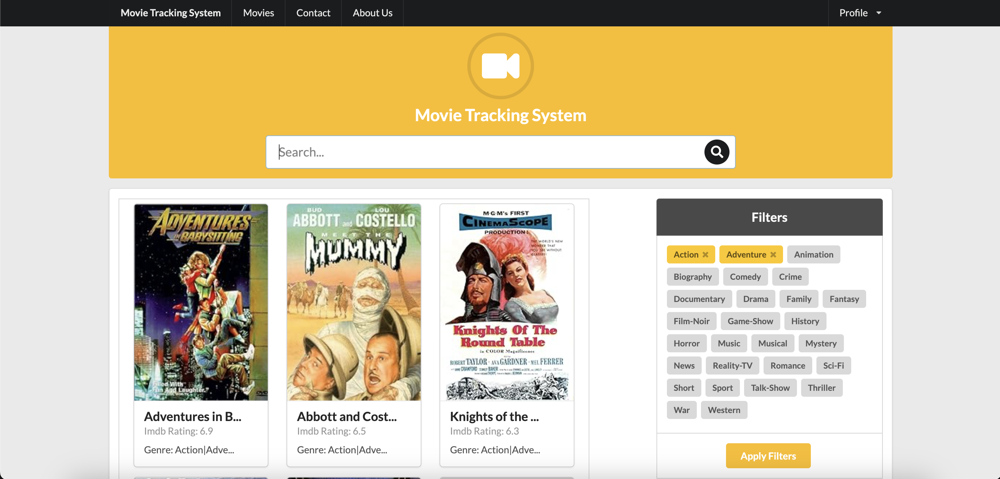

# Movie Tracking System

The Movie Tracking System enables users to search and filter movies from the IMDb database. Users can view IMDb ratings alongside each movie, and clicking on a movie redirects them to the IMDb page for detailed information. The project employs pagination and robust state management systems.

## Table of Contents

- [Screenshots](#screenshots)
- [Design Decisions](#design-decisions)
- [Technologies Used](#technologies-used)
- [Challenges Faced](#challenges-faced)
- [Installation](#installation)

## Screenshots


*Filter by genre feature of the application*


*Pagination feature of the application*


*Responsive design of the application*


*Error handling of the application*

## Design Decisions

### JSON Data Integration

In the initial stages of development, I had a JSON file containing comprehensive movie data. While a simplistic frontend implementation could have sufficed for simulation purposes, I opted to build out the entire application, encompassing both frontend and backend functionalities.

### Backend API Endpoint

The backend of our application has a single API endpoint: `/movies`. This endpoint facilitates the retrieval of a curated list of movies based on extracted query parameters from the URL.

### Pagination Implementation

To enhance user experience, I integrated the concept of pagination. The backend sends a batch of 10 movies per page, ensuring efficient handling of data. The API response not only includes the paginated movie list but also provides metadata such as the total size of the search result and the current page number. This information is used in implementing pagination on the frontend.

### Filter Feature

The application has a robust filtering feature, allowing users to refine search results based on genres. When a user selects multiple genres, these are transmitted to the backend as comma-separated parameters. Subsequently, the backend extracts and processes these parameters, checking them against the movie database to deliver precise and tailored search results.

## Technologies Used

- React: Chosen for its component-based structure, React enhances modularity in the codebase. Its virtual DOM ensures efficient updates to the UI, providing a seamless user experience.

- TypeScript: TypeScript was utilized for its ability to provide static type checking, allowing for early detection of errors during development. This ensures a more robust and reliable codebase.

- Node.js and Express (Backend): Node.js was selected for its event-driven, non-blocking I/O model, which makes it well-suited for handling concurrent requests. Express simplifies the development of robust APIs with its minimalistic and flexible framework.

- Semantic UI (UI Design): Semantic UI was employed for designing the website due to its extensive set of features and ease of implementation. Its theming system allows for rapid prototyping, and the responsive design ensures a consistent user experience across devices.

- Mobx (State Management): Mobx serves as the state management system, offering multiple stores within the application. This approach enhances modularity, making it easy to manage and scale the application. Mobx's reactivity system ensures efficient updates to the UI in response to changes in state.

## Challenges Faced

#### Handling Unavailable Images

One significant challenge encountered was the presence of many images that returned 404 errors. To address this issue, a custom default image was created using Canva, serving as a fallback to replace any missing images.

#### Pagination Implementation

Implementing pagination posed another challenge. Overcoming this involved carefully managing the flow of data between the frontend and backend, ensuring accurate tracking of the current page and extraction of the appropriate movie data.

#### Data Formatting and Feature Testing

Ensuring correct data formatting and feature functionality, such as searching by query or applying filters, required meticulous testing. Postman was initially employed to validate that the data was correctly formatted and the features were working as expected before integrating them into the client side.

#### Implementing Filter Feature

The implementation of the filter feature proved to be challenging due to the complexity of dynamically handling multiple genres and ensuring proper communication with the backend. Careful consideration was given to optimizing the filter functionality for a smooth user experience while avoiding unnecessary server requests.

These challenges were tackled through a combination of thorough testing, problem-solving, and iterative development to create a reliable and user-friendly movie tracking system.

## Installation

### Server API (server-api folder)

1. Navigate to the `server-api` folder.
2. Install dependencies using `npm install`.
3. Create a `.env` file in the root of the `server-api` folder with the following content:
    ```
    CLIENT_URL=http://localhost:3000
    ```
   Replace `http://localhost:3000` with the URL where the client application is running.

4. Run the server on port 3030 using `npm start`.

### Client App (client-app folder)

1. Navigate to the `client-app` folder.
2. Install dependencies using `npm install`.
3. Open `src/app/api/agent.ts` and update the `baseURL` to the server API URL. For example:
    ```typescript
    axios.defaults.baseURL = 'http://localhost:3030';
    ```
   Ensure it matches the URL where the server API is running.

4. Run the client application on a different port (e.g., 3000) using `npm start`.

Now, both the server and client should be running, and you can access the application by opening it in a web browser at the specified URLs.

Note: Make sure to run the server and client on different ports to avoid conflicts. Adjust the port numbers in the respective `npm start` scripts if needed.
